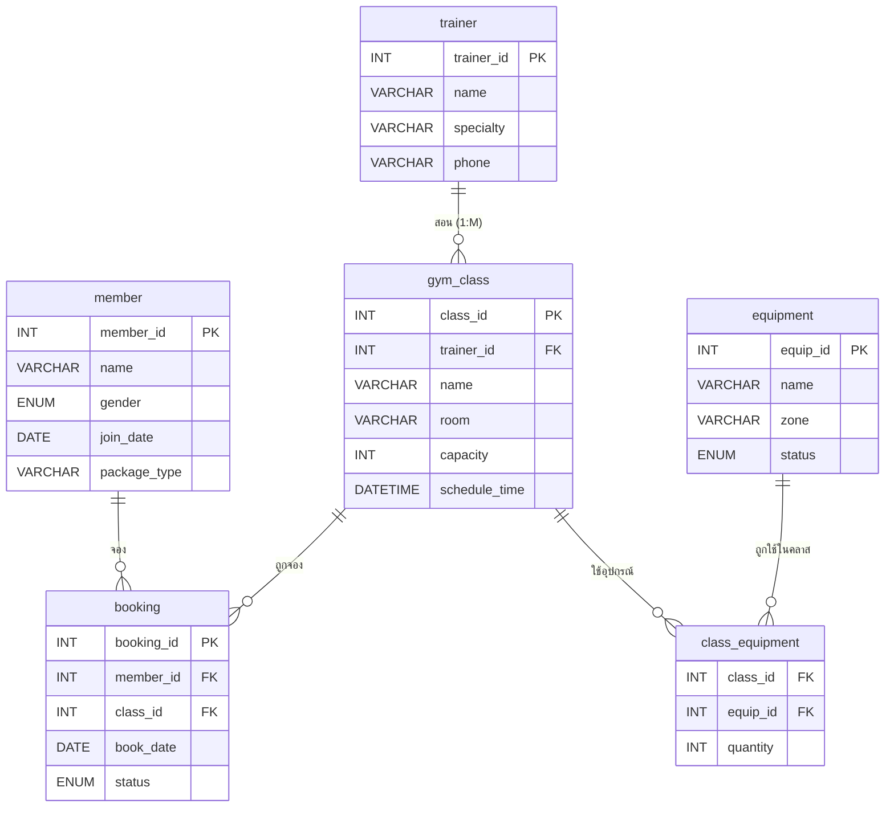

# Fitness System — ออกแบบคอลัมน์ & ER Diagram

## ER Diagram

> [!NOTE]
> - **booking** เป็นตาราง junction สำหรับ **M:N** ระหว่าง `member` กับ `gym_class`
> - **class_equipment** เป็นตาราง junction สำหรับ **M:N** ระหว่าง `gym_class` กับ `equipment`
> - **gym_class → trainer** เป็นความสัมพันธ์ **1:M** (Trainer 1 คน สอนได้หลายคลาส)

---

## รายละเอียดคอลัมน์ทุกตาราง

### 1. `member` — สมาชิก

| Column | Type | Constraint | Description |
|---|---|---|---|
| `member_id` | `INT` | `PRIMARY KEY`, `AUTO_INCREMENT` | รหัสสมาชิก |
| `name` | `VARCHAR(100)` | `NOT NULL` | ชื่อ-สกุล |
| `gender` | `ENUM('M','F','Other')` | `NOT NULL` | เพศ |
| `join_date` | `DATE` | `NOT NULL` | วันสมัครสมาชิก |
| `package_type` | `VARCHAR(50)` | `NOT NULL` | ประเภทแพ็กเกจ เช่น Daily, Monthly, Yearly |

---

### 2. `trainer` — เทรนเนอร์

| Column | Type | Constraint | Description |
|---|---|---|---|
| `trainer_id` | `INT` | `PRIMARY KEY`, `AUTO_INCREMENT` | รหัสเทรนเนอร์ |
| `name` | `VARCHAR(100)` | `NOT NULL` | ชื่อ-สกุล |
| `specialty` | `VARCHAR(100)` | `NOT NULL` | ความเชี่ยวชาญ เช่น Yoga, CrossFit, Boxing |
| `phone` | `VARCHAR(15)` | | เบอร์โทรศัพท์ |

---

### 3. `gym_class` — คลาสออกกำลังกาย (1:M จาก trainer)

| Column | Type | Constraint | Description |
|---|---|---|---|
| `class_id` | `INT` | `PRIMARY KEY`, `AUTO_INCREMENT` | รหัสคลาส |
| `trainer_id` | `INT` | `NOT NULL`, `FOREIGN KEY → trainer(trainer_id)` | เทรนเนอร์ผู้สอน |
| `name` | `VARCHAR(100)` | `NOT NULL` | ชื่อคลาส เช่น Morning Yoga, HIIT |
| `room` | `VARCHAR(50)` | `NOT NULL` | ห้องที่ใช้ เช่น A1, B2 |
| `capacity` | `INT` | `NOT NULL` | จำนวนคนรับสูงสุด |
| `schedule_time` | `DATETIME` | `NOT NULL` | วัน-เวลาที่เปิดสอน |

---

### 4. `booking` — การจอง (M:N junction: member × gym_class)

| Column | Type | Constraint | Description |
|---|---|---|---|
| `booking_id` | `INT` | `PRIMARY KEY`, `AUTO_INCREMENT` | รหัสการจอง |
| `member_id` | `INT` | `NOT NULL`, `FOREIGN KEY → member(member_id)` | สมาชิกที่จอง |
| `class_id` | `INT` | `NOT NULL`, `FOREIGN KEY → gym_class(class_id)` | คลาสที่ถูกจอง |
| `book_date` | `DATE` | `NOT NULL` | วันที่ทำรายการจอง |
| `status` | `ENUM('confirmed','cancelled','pending')` | `NOT NULL DEFAULT 'pending'` | สถานะการจอง |

---

### 5. `equipment` — อุปกรณ์

| Column | Type | Constraint | Description |
|---|---|---|---|
| `equip_id` | `INT` | `PRIMARY KEY`, `AUTO_INCREMENT` | รหัสอุปกรณ์ |
| `name` | `VARCHAR(100)` | `NOT NULL` | ชื่ออุปกรณ์ เช่น Dumbbell, Treadmill |
| `zone` | `VARCHAR(50)` | `NOT NULL` | โซนที่เก็บ เช่น Zone A, Zone B |
| `status` | `ENUM('available','in_use','maintenance')` | `NOT NULL DEFAULT 'available'` | สถานะอุปกรณ์ |

---

### 6. `class_equipment` — อุปกรณ์ที่ใช้ในคลาส (M:N junction: gym_class × equipment)

| Column | Type | Constraint | Description |
|---|---|---|---|
| `class_id` | `INT` | `FOREIGN KEY → gym_class(class_id)` | คลาสที่ใช้อุปกรณ์ |
| `equip_id` | `INT` | `FOREIGN KEY → equipment(equip_id)` | อุปกรณ์ที่ถูกใช้ |
| `quantity` | `INT` | `NOT NULL DEFAULT 1` | จำนวนอุปกรณ์ที่ใช้ |
| | | `PRIMARY KEY (class_id, equip_id)` | Composite PK |

---

## สรุปความสัมพันธ์

| Relationship | Type | คำอธิบาย |
|---|---|---|
| `trainer` → `gym_class` | **1 : M** | เทรนเนอร์ 1 คน สอนได้หลายคลาส |
| `member` ↔ `gym_class` (ผ่าน `booking`) | **M : N** | สมาชิกจองได้หลายคลาส, คลาสมีหลายสมาชิก |
| `gym_class` ↔ `equipment` (ผ่าน `class_equipment`) | **M : N** | คลาสใช้หลายอุปกรณ์, อุปกรณ์ถูกใช้ในหลายคลาส |
